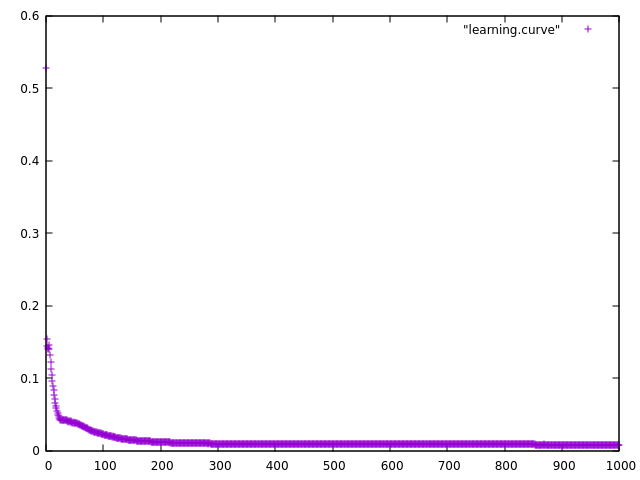

# Multi-layer Perzeptron

This is a java implementation of a Multi-Layer Perzeptron. This was an assignment for the lecture "Technical Neural Networks" at the Bonn University for the Winter Semester 18/19.

# Prerequisite

* mvn
* java >= 1.8
* gnuplot (for visualisation)

# Building

`mvn package`

# Runing

`java -jar ./target/tnn-1.0-SNAPSHOT.jar`

Valid args (opt.) : `-data=DATAFILE` and `-test=TESTFILE`
For example: `-data=training.dat -test=test.dat`

# Visualisation

`echo 'plot "learning.curve"' | gnuplot -p`

Example :

